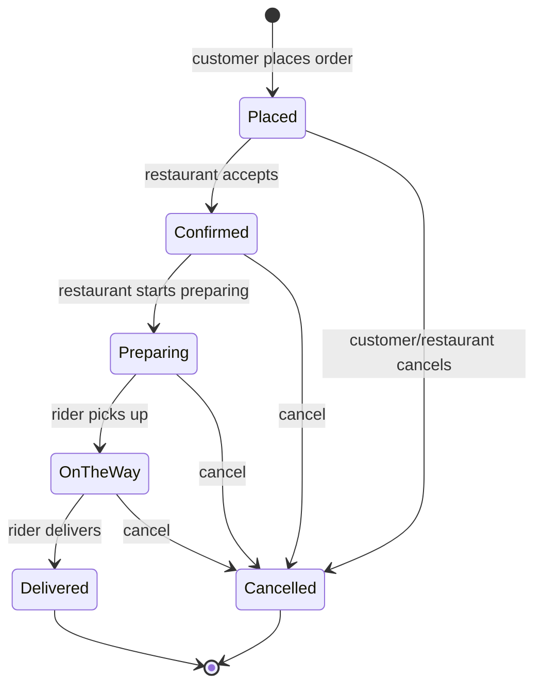

# 02 — Order State Machine

This doc covers the **order state machine diagram** required by the brief.

The brief specifies:

> *"Customer ordering flow with real-time order state machine (placed →
> confirmed → preparing → on_the_way → delivered)."*
> *"Finite state machine for order transitions with guards preventing
> invalid jumps."*
> *"Event-sourcing-inspired order history: every state change logged with
> timestamp and actor."*
> *"Validate state machine: rejected transitions (e.g., `delivered →
> preparing`) must throw."*

All four requirements are implemented in two files:

- **`app/Enums/OrderStatus.php`** — the states + the transition rule table.
- **`app/Services/Orders/OrderStateMachine.php`** — the only piece of code
  in the project allowed to write `orders.status`.

---

## 1. The states

```
┌──────────┬──────────────┬──────────────────────────────────────────┐
│   Enum   │ DB value     │  Meaning                                 │
├──────────┼──────────────┼──────────────────────────────────────────┤
│ Placed   │ placed       │  Customer submitted; awaiting restaurant │
│ Confirmed│ confirmed    │  Restaurant accepted                     │
│ Preparing│ preparing    │  Food being cooked (triggers dispatch)   │
│ OnTheWay │ on_the_way   │  Rider picked up; en route               │
│ Delivered│ delivered    │  Customer received the order (terminal)  │
│ Cancelled│ cancelled    │  Aborted by customer / restaurant / admin (terminal) │
└──────────┴──────────────┴──────────────────────────────────────────┘
```

PHP 8.1+ backed enum. Defined in `app/Enums/OrderStatus.php`.

---

## 2. Diagram (ASCII)

```
                          ┌─────────────┐
                          │   PLACED    │  ← initial state (PlaceOrder)
                          └──────┬──────┘
                                 │  customer
                  ┌──────────────┼─────────────────┐
                  │              │                 │
                  ▼              ▼                 ▼
            ┌──────────┐    ┌──────────┐
            │CANCELLED │    │CONFIRMED │
            │(terminal)│    └────┬─────┘
            └──────────┘         │  restaurant
                                 ▼
                            ┌──────────┐
                            │CANCELLED │  ← can be cancelled until terminal
                            │   ◄──────┤
                            └──────────┘
                                 │
                                 ▼
                          ┌─────────────┐
                          │ PREPARING   │  ─► triggers DispatchOrderJob
                          └──────┬──────┘
                                 │  restaurant
                                 ▼
                          ┌─────────────┐
                          │ ON_THE_WAY  │  ─► rider GPS broadcasts begin
                          └──────┬──────┘
                                 │  rider (picked-up)
                                 ▼
                          ┌─────────────┐
                          │ DELIVERED   │  ← terminal
                          │ (terminal)  │
                          └─────────────┘
```

### Mermaid version (renders on GitHub)



---

## 3. The transition rule table

This is `OrderStatus::allowedNextStates()` verbatim, then a table:

```php
return match ($this) {
    self::Placed    => [self::Confirmed, self::Cancelled],
    self::Confirmed => [self::Preparing, self::Cancelled],
    self::Preparing => [self::OnTheWay,  self::Cancelled],
    self::OnTheWay  => [self::Delivered, self::Cancelled],
    self::Delivered => [],   // terminal — no exits
    self::Cancelled => [],   // terminal — no exits
};
```

| From ↓ / To → | placed | confirmed | preparing | on_the_way | delivered | cancelled |
|---|:---:|:---:|:---:|:---:|:---:|:---:|
| **placed**    | —      | ✅        | ❌        | ❌         | ❌        | ✅        |
| **confirmed** | ❌     | —         | ✅        | ❌         | ❌        | ✅        |
| **preparing** | ❌     | ❌        | —         | ✅         | ❌        | ✅        |
| **on_the_way**| ❌     | ❌        | ❌        | —          | ✅        | ✅        |
| **delivered** | ❌     | ❌        | ❌        | ❌         | —         | ❌        |
| **cancelled** | ❌     | ❌        | ❌        | ❌         | ❌        | —         |

✅ = allowed · ❌ = throws `InvalidOrderTransitionException`

`delivered → preparing` is in the bottom row — every cell is `❌`. That's
the literal scenario the brief uses as a test case.

---

## 4. Guards (where invalid jumps are rejected)

The single check sits inside `OrderStateMachine::transition()`:

```php
if (! $from->canTransitionTo($to)) {
    throw new InvalidOrderTransitionException($from, $to);
}
```

Every API and browser controller routes through this method; no other
code in the app is allowed to write `orders.status` directly. That makes
the guard non-bypassable.

`canTransitionTo()` just delegates to `allowedNextStates()`:

```php
public function canTransitionTo(self $to): bool
{
    return in_array($to, $this->allowedNextStates(), strict: true);
}
```

---

## 5. The event-source-inspired history

Every transition writes to `order_status_history` in the **same DB
transaction** as the status update. Schema:

| Column | Type | Notes |
|---|---|---|
| id | bigint, PK | |
| order_id | FK → orders | |
| from_status | string, nullable | `NULL` for the initial "birth" event. |
| to_status | string | |
| actor_type | string | `customer`, `restaurant_owner`, `rider`, `admin`, `system`. |
| actor_id | bigint, nullable | The user id behind the transition (NULL for system-triggered). |
| reason | string, nullable | Cancellation reason or transition note. |
| occurred_at | datetime | The transition wall-clock time. |
| created_at | datetime | When the row was inserted (used as fallback for occurred_at). |

The table has `$timestamps = false`. There is **no `updated_at`** because
the table is **append-only**. Nothing in the codebase calls
`->update()` on a history row.

This is the *"event-sourcing-inspired order history"* required by the
brief. The current `orders.status` value is the projection; the
`order_status_history` is the truth.

### What the timestamp side-columns are for

On the `orders` table we **also** keep:

```
placed_at, confirmed_at, preparing_at, on_the_way_at, delivered_at, cancelled_at
```

These are fast-access duplicates so reporting queries (e.g. "show me
order throughput by hour") don't need to JOIN against history. The FSM
stamps the relevant one inside the same transaction.

Source: `OrderStatus::timestampColumn()` returns the column name for the
given state; `OrderStateMachine::transition()` writes it.

---

## 6. Who can drive each transition?

Authorisation lives in the controllers + the role middleware; the FSM
itself doesn't care who's driving it.

| Transition | Allowed actor | API entry point |
|---|---|---|
| → placed (initial) | customer | `POST /api/customer/orders` |
| placed → confirmed | restaurant owner | `POST /api/owner/orders/{order}/confirm` |
| confirmed → preparing | restaurant owner | `POST /api/owner/orders/{order}/start-preparing` |
| preparing → on_the_way | rider (auto-assigned) | `POST /api/rider/orders/{order}/picked-up` |
| on_the_way → delivered | rider | `POST /api/rider/orders/{order}/delivered` |
| placed/confirmed → cancelled | customer | `POST /api/customer/orders/{order}/cancel` |
| any non-terminal → cancelled | restaurant owner / admin | `POST /api/owner/orders/{order}/cancel` |

Browser equivalents under `routes/web.php` mirror these.

---

## 7. Side effects the FSM fires

Each transition is more than just a status change. The FSM fires the
right side-effects automatically:

| Event in the FSM | What fires |
|---|---|
| **initialize → placed** | `SendOrderNotificationJob('placed')`, `RecalculateSurgePricingJob` |
| **any transition** | `OrderStateChanged` broadcast event (Reverb) |
| **any transition** | `SendOrderNotificationJob(<new state>)` |
| **→ Preparing** (no rider yet) | `DispatchOrderJob` pushed to the queue |
| **→ Delivered** | `RecalculateSurgePricingJob` (supply just freed up) |
| **→ Cancelled** | `RecalculateSurgePricingJob` |

This is the only place in the app that knows about side effects per
state. Controllers don't fire jobs or events directly.

---

## 8. Concurrency & integrity

Everything in `OrderStateMachine::transition()` runs inside one DB
transaction. The status update and the history row are written together;
if either fails, both roll back.

The rider dispatch step (which is triggered on transition into
`Preparing`) uses `lockForUpdate()` on the rider rows so two concurrent
"start preparing" calls cannot assign the same rider to two different
orders. This is the scenario the
`tests/Feature/Stress/OrderVolumeSpikeTest.php` test simulates with 50
concurrent orders against 10 riders.

---

## 9. How to test the FSM

### Unit-level (file-level) tests

```powershell
php artisan test --filter=OrderStateMachineTest
```

The test file (`tests/Feature/Orders/OrderStateMachineTest.php`) covers:

| Test | Asserts |
|---|---|
| `valid_transition_writes_status_and_appends_history` | A row is written to `order_status_history` and `orders.status` updates. |
| `invalid_transition_throws` | `delivered → preparing` throws `InvalidOrderTransitionException`. |
| `initial_state_is_placed` | New orders start at `placed` with a history "birth" row. |
| `timestamp_column_is_stamped_on_transition` | `confirmed_at`, `preparing_at`, etc. populated when entering each state. |
| `cancellation_reason_is_persisted` | Cancellation reason saved on the order row + the history row. |

### Browser

1. Login as `customer1@demo.test`, place an order at Demo Bistro.
2. Login as `owner@demo.test`. Click **Confirm**, then **Start preparing**.
3. Login as `rider1@demo.test` (assigned via dispatch). Click **Picked up**, then **Delivered**.
4. Open `/orders/{id}` — the **timeline** at the bottom shows every state
   change with the actor and timestamp.

### Database

```sql
USE fooddelivery;
SELECT * FROM order_status_history WHERE order_id = 1 ORDER BY occurred_at;
```

You'll see one row per transition. No row is ever updated.

### Try to break it (negative path)

Try cancelling a delivered order from tinker:

```powershell
php artisan tinker
```

```php
$order = App\Models\Order::find(1);
$order->update(['status' => 'delivered']);
app(App\Services\Orders\OrderStateMachine::class)
    ->transition($order, App\Enums\OrderStatus::Preparing, 'admin', 1);
```

→ throws `App\Exceptions\InvalidOrderTransitionException: Cannot transition from delivered to preparing.`

That's the literal test the brief asks for.
